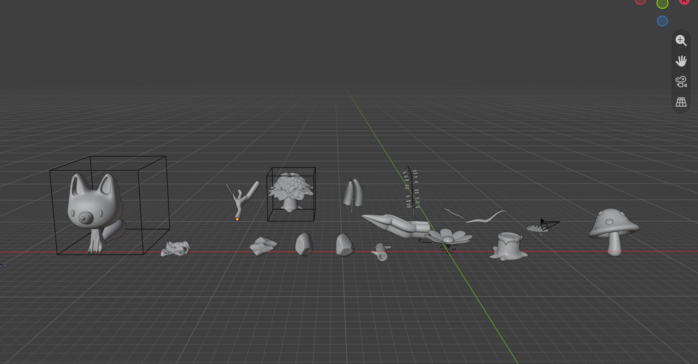
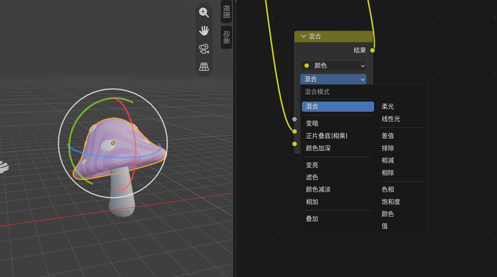
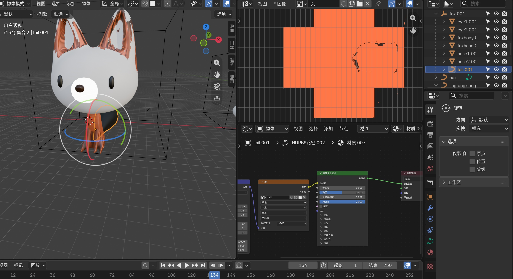
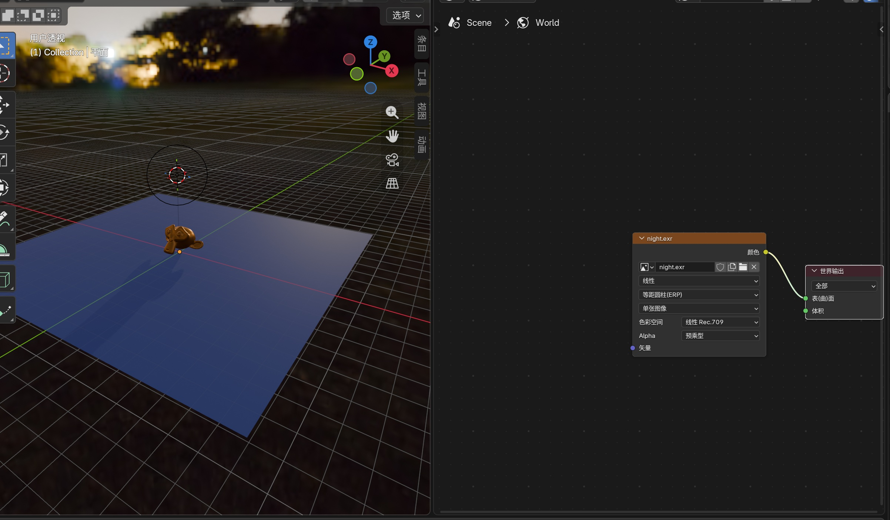
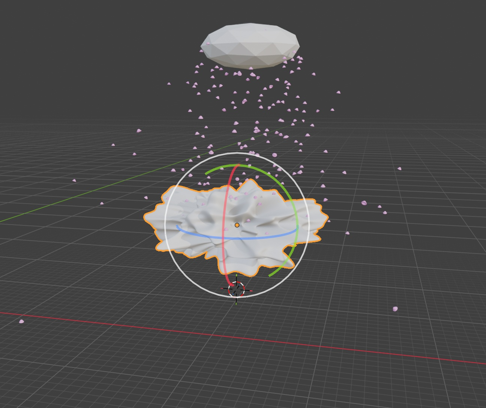

# 视觉小说背景三渲二管线 - 开发日志

## Day 1 - 初识Blender与基础操作 (2026-07-22)

### 今日状态
- **当前进度**：从零起步，首次接触3D建模软件。
- **学习方式**：跟随B站教程，熟悉Blender的基本界面和核心操作。

### 今日目标
- 完成Blender 4.x 版本的安装与环境配置
- 熟悉Blender的四大核心区域（3D视图、大纲视图、属性面板、时间线）
- 掌握基础变换操作：移动 (`G`)、旋转 (`R`)、缩放 (`S`)

### 过程记录

*图1：Blender主界面布局及今日练习的立方体*

### 今日学习心得
- **最大的感受**：3D空间的操作逻辑和2D绘画完全不同，但不需要花时间建立空间感，因为界面很简单易懂。鼠标中键旋转视角的感觉很有趣，感觉像在玩3d游戏。
- **一个小难点**：刚开始容易搞混“物体模式”和“编辑模式”，多切换几次就习惯了。

### 资源
- 跟学视频：[https://www.bilibili.com/video/BV14u41147YH?spm_id_from=333.788.player.switch&vd_source=37cf9b55eeac934a96aa1fb06c88815f&p=3] (1.1-1.3)

## Day 2 - 完成第一个建模练习 (2026-07-23)

### 今日状态
- **当前进度**：完成 Blender 基础操作学习，跟练完成第一个完整建模练习。
- **学习方式**：跟随 KurTips 的《Blender零基础入门教程》，完成 P5 【基础篇】1.4 本章练习[reference:5]。

### 今日目标
- 熟悉 Blender 的建模工具栏与基础操作
- 完成“戴珍珠耳环的少女”模型练习
- 解决材质实时预览问题（需切换到“材质预览”或“渲染模式”）
- 解决多视图合并问题（右键边框 → 合并区域）
- 学会修改渲染背景（世界属性 → 颜色 / 环境纹理 / 透明背景）

### 过程记录

*图1：跟练完成的“珍珠耳环的少女”模型*

### 今日学习心得
**1. 材质实时预览的关键**
调材质时不能实时看到效果，是因为没有切换到正确的视图模式。按 `Z` 键或在视口右上角点击**第三个图标（球体带棋盘格）** 进入“材质预览”模式，材质变化就能实时显示了。如果需要更精确的光影效果，可以切换到**第四个图标（渲染模式）**。

**2. 视图管理小技巧**
不小心拖拽出多个视图时，不用慌张。在两个视图的**边框上右键**，选择 **“合并区域”** ，然后箭头指向想保留的视图即可。Blender 的界面非常灵活，不小心弄乱是每个人的必经之路。

**3. 渲染背景的三种改法**
- **纯色背景**：世界属性 → 表面 → 颜色
- **图片/HDRI背景**：世界属性 → 表面 → 环境纹理 → 打开图片
- **透明背景**（方便后期）：渲染属性 → 胶片 → 勾选“透明”，输出格式选 PNG + RGBA

**4. 第一个模型的感受**
从默认立方体到做出完整的模型，虽然只是跟着教程一步步操作，但第一次感受到“在3D空间里搭建东西”的乐趣。

### 性能数据（基于联想 Yoga 轻薄本测试）
- 软件版本：Blender 4.x (x64)
- 设备型号：联想 Yoga 14 ILL10 (Intel Core Ultra)
- 视图模式：材质预览模式下操作流畅，无卡顿
- 渲染引擎：Eevee（对轻薄本友好）

### 明日计划
- 继续推进教程进度，学习更复杂的建模技巧
- 思考如何将建模技能应用到视觉小说背景场景搭建中

### 今日资源
- 跟学视频：KurTips《Blender零基础入门教程》 BV14u41147YH
- 完成章节：P5 【基础篇】1.4 本章练习

## Day 3 - 建模工具进阶 (2026-07-24)

### 今日状态
- **当前进度**：完成 P6-P8（2.1-2.3），掌握Blender常用建模修改器与进阶工具。
- **学习方式**：跟随 KurTips《Blender零基础入门教程》系统学习建模工具链。

### 今日目标
- 掌握 **修改器** 的基本概念与用法（阵列/细分/实体化/倒角）
- 学会使用 **旋转/挤出/缩放** 等工具的进阶技巧
- 完成2.1-2.3章节的随堂练习

### 过程记录

### 今日学习心得

**1. 修改器是建模的“魔法开关”**
今天最大的收获是理解了修改器的逻辑——它不是直接改变模型本身，而是在模型之上叠加一层“效果”。这样做的好处是：
- **不破坏原始几何体**，随时可以调整参数
- **多个修改器可以叠加使用**，产生复杂效果
- **阵列 + 细分 + 实体化** 三个组合，就能做出很多之前觉得复杂的东西

**2. 阵列修改器的实用价值**
对于视觉小说背景来说，阵列简直是神器：
- 一排排的课桌椅 → 阵列搞定
- 书架上的隔层 → 阵列搞定
- 教室窗户的重复结构 → 阵列搞定
**这让“重复劳动”大幅减少，终于能体会到建模为什么比手绘高效了。**

**3. 关于三渲二的思考**
虽然目前还在学基础建模，但脑子里已经在规划最终目标了：
- 学会了**倒角修改器** → 卡出二次元风格需要的硬边/软边
- 学会了**细分修改器** → 让模型表面更光滑，方便后期上卡通材质
- 学会了**阵列修改器** → 批量生成场景元素，大幅提升效率

**4. 从“跟着做”到“自己做”的转变**
今天试着不看教程的下一步，提前自己做完全部过程，虽然中间出现了很多变故，出现了不会细分，记不住快捷键等基础性情况，让我对每个工具的理解加深了，同时也深刻意识到自己的不足之处。

### 性能数据
- 修改器叠加使用时，视口依然流畅（轻薄本无压力）
- 建议：视口显示层级设置为“优化”，避免高细分显示卡顿

### 明日计划
- 继续推进2.4及后续章节
- 开始思考第一个视觉小说背景的场景构图

### 今日资源
- 跟学视频：KurTips《Blender零基础入门教程》BV14u41147YH
- 完成章节：2.1-2.3（修改器基础、阵列、细分、倒角等）

## Day 4 - 建模进阶与“踩坑”实录 (2026-07-25)

### 今日状态
- **当前进度**：完成 P9（2.4 章节），在建模练习中密集遇到并解决了多个新手“经典困境”。
- **学习方式**：跟随 KurTips《Blender零基础入门教程》推进，在实战中积累工程经验。

### 今日目标
- 完成 2.4 章节的建模练习
- 掌握 **表面吸附** 功能的完整设置
- 理解 **原点** 与 **几何中心** 的关系，学会修复原点偏离
- 解决“吸附方向反向”问题（目标物体法线方向）
- 掌握 **父子级** 设置（Ctrl+P）
- 学习 **融并边/合并顶点** 操作
- 解决 Shift+A 菜单异常的突发问题

### 过程记录

### 今日踩坑与心得

今天的学习几乎是一场“Blender新手问题大杂烩”，但每解决一个问题，对软件的理解就深一层：

**1. 表面吸附的“正确姿势”**
- **坑**：开了磁铁但死活吸不上，或者吸上去方向是反的。
- **解**：
  - 磁铁要开，**吸附至选“面”**，基准点建议选“中心”或“最近”。
  - 如果方向反了，**检查目标物体的法线方向**（编辑模式下 Alt+N → 重新计算外部）。
  - 关闭 **“对齐旋转到目标”** 可以避免吸附时物体乱转。
  - 最坏的情况下重新建模，如果模型本身反转了那最后吸附的面也是被反转了的面，无法达成想要的效果。

**2. 原点偏离与吸附反向的连锁反应**
- **坑**：在编辑模式下移动整体网格，导致原点留在原地；重置原点后又出现吸附反向。
- **解**：这是“变换数据”与“网格数据”脱节导致的。标准修复流程：
  - 物体模式下按 **Ctrl+A → 全部变换**（烘焙当前变换）
  - 再按 **Ctrl+Shift+Alt+C → 原点→几何中心**
  - 做完这两步，物体就是“干净”的了

**3. 父子级（Parenting）**
- **快捷键**：先选孩子，再选爸爸（最后选中的是父级），按 **Ctrl+P**
- **建议**：选 **“物体（保持变换）”**，子物体不会跳位置
- **用途**：把多个零件组成一个整体，移动父级时子级跟随

**4. 融并边 vs 合并顶点**
- **融并边（Dissolve Edges）**：删掉选中的边，自动合并周围面，不破坏模型
- **合并顶点（Merge Vertices）**：把两个点焊接到一起，按 M 键
- **按距离合并（By Distance）**：一键清理模型中的重叠顶点，非常实用

**5. Shift+A 菜单只剩“网格”怎么办？**
- **原因**：误触了菜单顶部的搜索框，或界面状态被锁定
- **解**：按 Esc 退出，或点击左上角工作区下拉菜单重新选“建模”，或恢复默认界面

### 性能数据
- 今日模型面数增加，但轻薄本仍流畅运行，除了在使用修改器时不小心按错快捷键导致加了上百个细分后电脑崩溃了一次，顺便知道了轻薄本能承载的上限很搞
- 建议：频繁保存（Ctrl+S），养成习惯

### 明日计划
- 继续推进教程后续章节
- 计划将学到的吸附、原点、父子级等技巧应用实际场景搭建中

### 今日资源
- 跟学视频：KurTips《Blender零基础入门教程》BV14u41147YH
- 完成章节：2.4
- 主要练习：建模进阶操作

## Day 5 - 阵列与物体偏移 (2026-07-26)

### 今日状态
- **当前进度**：完成 P10（2.5 章节），掌握利用 **阵列修改器 + 物体偏移** 制作重复元素（如叶片、栏杆）。
- **学习方式**：跟随 KurTips 教程实战，经历“阵列复制乱飞→原点对齐→旋转矫正”的完整调试过程。

### 今日目标
- 掌握阵列修改器 (Array Modifier) 的基础参数
- 理解 **物体偏移 (Object Offset)** 的逻辑：以空物体为基准控制复制品的变换
- 学会将游标与原点对齐（Shift+S 的灵活运用）
- 解决“叶子旋转歪斜”的问题（视角与空间感的训练）

### 过程记录

### 今日踩坑与心得

**1. 阵列偏移的核心逻辑**
- **物体偏移**：指定一个空物体（Empty），阵列出来的每个副本都会继承这个空物体的位移、旋转和缩放增量。
- **应用场景**：非常适合制作视觉小说背景里的重复元素（树叶、路灯、栏杆、砖纹）。只要转动空物体，整排叶子就会跟着弯折，效率极高。

**2. 今天最大的教训：视角！视角！视角！**
- 在透视视图（Perspective）下旋转空物体，由于近大远小的视觉干扰，我觉得自己转正了，但实际歪了几度。
- **正解**：按小键盘 **1（正视图）、3（右视图）、7（顶视图）** 切换到正交视图（Orthographic）进行精确旋转。
- **补刀**：如果笔记本没有小键盘，可以在 `编辑` → `偏好设置` → `输入` 中勾选 **“模拟数字键盘”**，用主键盘区的数字键替代。

**3. 原点与游标的默契配合**
- 想让叶子绕着根部旋转？先把游标放到根部（Shift+右键），再设置原点为3D游标。
- 想让空物体控制叶片不偏移？确保空物体和叶片的原点都在同一个世界坐标点上（Shift+S 联动调整）。

**4. 一个调试小技巧**
- 如果阵列效果乱了，**先关掉修改器的显示（点眼睛图标）**，检查基础模型。基础模型没问题，再开眼睛检查偏移物体。分段排查比瞎调快十倍。

### 明日计划
- 完成 2.6 及后续章节，逐步从“跟练”过渡到“自建场景”。
- 构思我的第一个视觉小说背景草图，准备把学到的阵列、修改器都派上用场。

### 今日资源
- 跟学视频：KurTips《Blender零基础入门教程》 BV14u41147YH
- 完成章节：2.5 - 物体偏移与阵列

## Day 6 - 第二章完结：从“跟练”到“自有” (2026-07-27)

### 今日状态
- **当前进度**：完成 KurTips 教程 **第二章（P6-P14）** 全部内容，正式迈过 Blender 入门门槛。
- **学习方式**：从“跟着教程一步步做”转向“关掉教程，自己尝试复现并扩展”。

### 今日目标
- 完成第二章剩余章节的学习
- 系统梳理第二章核心知识点：修改器体系（阵列/镜像/细分/倒角/实体化）

### 过程记录

### 今日学习心得

**1. 第二章到底教会了我什么？**

如果说第一章是“认识Blender的零件”，那第二章就是“学会了怎么把这些零件组装成工具”。核心收获是建立了**修改器思维**：

| 修改器 | 一句话功能 | 在视觉小说背景中的用途 |
| **阵列 (Array)** | 重复复制 | 一排排课桌椅、书架隔层、窗户序列 |
| **镜像 (Mirror)** | 对称复制 | 对称的房间结构、树木、人物（如果做立绘） |
| **细分 (Subdivision)** | 让表面变光滑 | 圆润的柱子、弧形窗户、柔和边缘 |
| **倒角 (Bevel)** | 把棱角磨圆 | 二次元风格需要的“硬边卡线”效果 |
| **实体化 (Solidify)** | 给薄片加厚度 | 纸张、布料、墙壁的厚度感 |

**2. 最大的转变：从“跟着做”到“关掉做”**

今天最后一个小练习，我没有开教程，而是尝试凭记忆复现一个之前做过的模型。中间卡壳了三次（忘了怎么加镜像轴、细分太过了拉不回来、阵列偏移量没算对），但**每卡一次，就翻回去看一眼笔记，而不是直接看教程视频**。这个“卡壳→翻笔记→自己解决”的循环，比看十遍教程都有用。

**4. 关于“不完美”的接受**

第二章做出来的东西依然有很多瑕疵——比例有点怪、布线不够干净、有些地方偷懒没做细节。但就像老师说的：“完成比完美重要。” 现在的目标是“能动起来”，不是“能展出”。等第三章学会了材质和渲染，再回头优化也来得及。

### 明日计划
- 进入 **第三章：材质与渲染**，正式开始学习三渲二的核心——卡通材质节点
- 尝试给第二章的某个练习模型赋予基础颜色材质
- 规划第一个“原创场景”的草图（打算从房间开始）

### 今日资源
- 跟学视频：KurTips《Blender零基础入门教程》 BV14u41147YH
- 完成章节：第二章（全）
- 累计学习时长：约 6 天，从零到完成基础建模模块

## Day 7 - 材质入门：从“灰模”到“有色” (2026-07-28)

### 今日状态
- **当前进度**：进入第三章 **材质与纹理**（P12-P14，3.1-3.3），从建模思维切换到材质思维。
- **学习方式**：跟随 KurTips 教程，学习 Blender 材质系统的核心逻辑。

### 今日目标
- 理解 Blender 材质系统的核心：**原理化BSDF** 节点
- 学会为物体 **新建材质、分配材质、修改颜色**
- 掌握 **材质预览模式** 与 **渲染模式** 的切换使用
- 了解基础节点的连接逻辑（Shift+A 添加节点，拖拽连线）
- 尝试制作简单的卡通色块材质

### 过程记录

### 今日学习心得

**1. 建模 vs 材质：两种完全不同的“脑回路”**
建模时关注的是 **“形状”** （顶点、边、面的位置），而材质关注的是 **“表面属性”**（颜色、粗糙度、金属度、发光）。前者是“骨架”，后者是“皮囊”。之前几天的建模训练，都是在为今天学习“如何给模型穿衣服”做准备。

**2. 原理化BSDF：所有材质的“母体”**
它是一个万能的着色器节点，大部分材质都可以通过调节它的参数来实现：
- **颜色 (Color)**：最直观，改这里就等于“上色”
- **粗糙度 (Roughness)**：0=镜面反射（光滑），1=完全哑光
- **金属度 (Metallic)**：0=非金属（塑料/布），1=金属
- **发光 (Emission)**：让物体自发光，适合做屏幕、灯管、魔法效果

**3. 材质的“分配”逻辑**
一个物体可以拥有多个材质，不同的面可以分配不同的材质。比如一个杯子，杯身是陶瓷材质，杯柄是金属材质。需要在编辑模式下选中特定的面，然后在材质列表里点击“指定”。

**4. 三渲二的“前奏”**
虽然还没正式学卡通材质节点（要到3.4之后），但今天的基础已经埋下伏笔了：
- **粗糙度拉高** → 消除真实光泽 → 向赛璐珞风格靠近
- **颜色明快** → 纯色色块 → 动漫质感
- **关闭阴影接收**（渲染属性里可调）→ 减少写实感

### 性能数据
- 材质预览模式下，轻薄本依然流畅
- 建议：在材质预览模式下，可以适当降低渲染采样数，提高视口响应速度

### 明日计划
- 继续 3.4-3.6 章节，学习 **颜色渐变节点 (ColorRamp)** 和 **贴图纹理** 的使用
- 正式进入三渲二核心：用“着色器转RGB+颜色渐变”制作卡通色块

### 今日资源
- 跟学视频：KurTips《Blender零基础入门教程》 BV14u41147YH
- 完成章节：3.1 - 3.3（材质基础、原理化BSDF、材质分配）

## Day 8 - 材质进阶：纹理绘制与渐变 (2026-07-29)

### 今日状态
- **当前进度**：完成 3.4 - 3.6（UV展开、纹理绘制、渐变工具）。
- **学习策略**：从“死磕细节”转向“广度优先”——只确保理解核心操作，不过度雕琢临时练习，把精力留给后续的场景搭建。

### 🎯 今日目标
- 理解 UV 展开的基本逻辑（3D模型 → 2D平面映射）
- 掌握纹理绘制的基础流程（新建纹理 → 进入绘制模式 → 笔刷上色）
- 学会使用填充工具的渐变模式（线性/径向渐变）
- 完成 3.6 狐狸建模的材质试用，确认操作无误
- **主动跳过**：与目前想做的视觉小说背景关联不大的精细化建模细节

### 过程记录

### 💡 今日学习心得

**1. 学会“跳过”也是一种能力**

不像第二章每个练习都死磕到完美，今天很多操作只是“试了一下，确认会了”就放过去了。因为：
- 3.6 的狐狸建模是角色向的，和我做背景的目标不一致
- 纹理绘制的精细度需要大量时间打磨，但核心操作只有几步

**2. UV展开的本质**

UV就是把3D模型的“外皮”剥开平铺成2D画布。就像拆一个纸盒子，摊平后才能在上面画图案。步骤：
- 进入编辑模式 → 标记缝合边（`Ctrl+E` → 标记缝合边）
- `A` 全选 → `U` → 展开
- 在 UV 编辑器里调整，避免拉伸

**3. 纹理绘制 ≈ SAI2 的3D版本**

今天的实践验证了之前的对照表：
- 主色/次色 = SAI2的前景色/背景色（都是按 `X` 切换）
- `F` 键调笔刷大小 = SAI2的 `[` 和 `]`
- `S` 键吸色 = SAI2的吸管
- 渐变模式藏在“填充工具”的右侧“工具”面板里（扳手图标）

**4. 对三渲二的进一步理解**

今天更清楚地意识到：三渲二的“材质感”，本质上是在 **UV绘制阶段画出色块**，再配合 **材质节点的处理**，而不是靠建模本身的细节。所以：
- **建模** = 搭建舞台
- **UV绘制** = 给舞台画背景幕布
- **材质节点** = 打光 + 滤镜

**5. 对UV编辑器的一些理解**
- 吸取颜色最好从UV编辑器中吸取，而不是实际建模，实际建模会受到灯光光线等影响导致吸取的颜色偏灰偏暗，对比度降低
- 意识到如果以后做产品外包装UV是非常重要的
- 用UV绘制时总共有两种雕刻细节的方法，一种是选面后单独进行新建材质（不推荐这个因为无法更改），一种是在编辑模式下选好面，再到纹理绘制模式下选用遮罩，这样就可以进行后续与整体的更改

### 当前进度总览
- Blender 总进度：第3章完成
- 已投入学习天数：8 天
- 下一阶段：**第5章（灯光，重点学习）**

### 明日计划
- 进行第三章最后一节的学习，看一下基本渲染内容中有哪些小知识点自己没听到，巩固完善
- 进入第5章 **灯光与场景**，这是做出成品视觉小说的关键
- 开始构思第一个完整的原创场景（准备从房间开始）

### 今日资源
- 跟学视频：KurTips《Blender零基础入门教程》 BV14u41147YH
- 完成章节：3.4 - 3.6
- 学习策略：**广度优先，确保掌握即可**

## Day 9 - 灯光初探与“补课”决策 (2026-07-30)

### 今日状态
- **当前进度**：完成 3.7（纹理绘制收尾）+ 5.1-5.2（灯光基础与日光系统）。
- **学习方式**：快速略过 5.3（场景布光实战），确认无新增知识点，决定延期细看。
- **关键决策**：计划回补第4章（粒子系统），为后续场景搭建铺路。
- **硬件认知**：轻薄本跑 Cycles 吃力，需调整学习策略。

### 今日目标
- 了解 Blender 灯光系统的基本类型（点光、面光、日光）
- 亲自体验 Cycles 渲染器的性能负担（确认轻薄本不适合实时 Cycles 工作流）
- 掌握 HDR 环境纹理的使用（替代实时日光模拟的“平替方案”）
- 认识到粒子系统在场景搭建中的必要性 → 决定补课
- 快速评估 5.3 章节，确认延期回头看

### 过程记录

### 今日学习心得

**1. Cycles：轻薄本的“禁区”**

今天被迫试了一下 Cycles，结论很直接：
- 视口拖动：卡顿明显
- 实时预览：基本不可用
- 最终渲染：可以挂机等，但交互式调整不可能

**结论**：在拥有台式机或云渲染资源之前，**日常学习和预渲染坚定使用 Eevee**。Cycles 只作为“最终出图前挂机渲染”的选项。

**2. 日光系统 vs HDR 环境纹理**

老师演示了用“日光”配合 Cycles 模拟日出日落，但我发现：
- 日光系统需要 Cycles 的光线追踪计算才能真正出效果（轻薄本扛不住）
- **HDR 环境纹理是完美的平替方案**：加载一张 HDR 图片，立马获得自然的天空光照和反射，且 Eevee 下完全流畅

**小技巧**：用 HDR 做环境光 + 补一盏面光打亮主体，效果不输 Cycles 日光模拟，而性能开销只有后者的十分之一。

**3. 粒子系统：不是“可不学”，是“必须懂”**

老师在 5.2 中用粒子系统做了草地，我意识到：
- 视觉小说背景里，草地、树林、落叶、飘雪…… 全是粒子系统的应用
- 虽然之前判断“第四章可以跳过”，但那是对“纯室内静态场景”而言
- **如果要让场景有生命力，粒子系统是绕不开的**

**决策**：明天花 1-2 天快速补完第四章，目标是“能做出草地和简单粒子效果”，不求精通，但求会用。

**4. 5.3 快速评估：跳过没问题，但有三个“隐藏细节”**

今天快速略过了 5.3“本章练习-场景布光”，确认它本质上是 5.1+5.2 的综合运用，没有全新的知识点。因此决定等自己开始搭场景打光时再回头细看。

不过快速扫过时，发现了 3 个容易被忽略但很实用的技巧：

| 隐藏技巧 | 说明 |
| :--- | :--- |
| **树叶光斑** | 在聚光灯前加一个带噪波纹理（Noise Texture）的透明材质圆片，可模拟树叶间透过的斑驳光影 |
| **粒子草地** | 5.3 用粒子系统生成了草地，印证了补第4章的必要性 |
| **Eevee 透明设置** | 要实现透明效果，材质混合模式和阴影模式必须设为 **“Alpha Hashed”**（否则透明不生效） |

这些细节不是独立知识点，但等做自己的场景时，记得回来看它们怎么组合使用。

**5. 今天最大的认知升级**

> **“不是所有功能都需要学，但所有功能都应该知道它存在。”**

今天如果不是因为看到老师用粒子做草，我可能永远不会想起去翻第四章。但恰恰是“看见了→意识到需要→回头补”这个循环，才是真实的学习路径——而不是线性地按顺序啃完每一章。

### 当前硬件策略总结
- **建模/材质/UV绘制**：Eevee + 材质预览模式 → 完全流畅
- **灯光预演**：HDR + 补光，Eevee 下完成 → 流畅
- **最终渲染**：如需 Cycles，挂机渲染 → 接受等待
- **粒子调试**：视口显示调低 → 保持流畅

### 明日计划
- 快速补完 **第4章 粒子系统**（目标：能做出草地、飘落物）
- 继续第5章灯光（5.3之后）
- 开始构思第一个原创场景的灯光方案

### 今日资源
- 跟学视频：KurTips《Blender零基础入门教程》 BV14u41147YH
- 完成章节：3.7、5.1、5.2
- 快速评估：5.3（延期细看）
- 新增决策：回补第4章粒子系统

## Day 10 - 粒子系统收官与“独立创作”启程 (2026-07-31)

### 今日状态
- **当前进度**：完成第4章（粒子系统）。
- **学习模式切换**：从“按教程顺序推进”转向 **“目标导向的自主学习”**。
- **明日计划**：以 B站视频《三渲二场景入门》的**第四、五期**为蓝本，系统学习三渲二渲染技术【4†L1-L3】。

### 今日目标
- 完成第4章粒子系统学习（草地、飘落物、基础物理模拟）
- 确认粒子系统在视觉小说背景中的应用场景
- 制定明日学习计划：以《三渲二场景入门》4-5期为蓝本

### 过程记录

### 今日学习心得

**1. 粒子系统：不仅是“草”，更是“生命力”**

第四章快速过完，核心收获是理解了粒子系统的本质：
- **粒子 ≠ 小点**：在Blender里，“粒子”可以是任何物体（草叶、石块、蝴蝶、落叶）
- **发射器 vs 毛发**：两种模式——“发射器”适合做飘落/飞散效果；“毛发”适合做草地/绒毛
- **渲染为物体**：这是做草地、树林的核心——让粒子“变成”你准备好的模型

**对视觉小说背景的价值**：
- 草地/花丛（室外场景必备）
- 飘落的樱花/雪（氛围渲染）
- 路灯下的飞虫（细节生命力）

**2. 明天的方向明确了**

我找到了一份三渲二场景学习的视频资料（BV1owC2YgE1H），计划以它的**第四、五期**为核心进行学习【4†L1-L3】。这两期主要涉及：
- 三渲二材质的核心节点配置
- 场景打光与氛围营造的实战技巧

这意味着明天我将正式进入 **“三渲二效果落地”** 阶段——把之前学的建模、材质、灯光、粒子全部串起来，做出真正能用的视觉小说背景。

**3. 从“学习模式”切换到“创作模式”**

之前的10天是按教程顺序走，确保“知道Blender有什么”。但从明天起，学习方式会变成：
- **先看效果**：通过视频了解三渲二能达到什么程度
- **再拆解技术**：分析“这个效果需要用哪些Blender功能”
- **然后动手做**：不依赖步骤，自己从头搭场景、调材质
- **最后迭代**：遇到不会的再去查，学到的立刻用上

### 明日计划
- 观看《三渲二场景入门》第四、五期【4†L1-L3】
- 跟随视频完成三渲二材质的节点配置练习
- 尝试将学到的渲染效果应用到自己的场景中
- 开始构思第一个原创场景的打光方案

### 今日资源
- 完成章节：第4章 粒子系统（全）
- 明日素材：BV1owC2YgE1H《三渲二场景入门》4-5期【4†L1-L3】
- 下一阶段：三渲二效果学习与独立创作

### 写在最后

明天开始，我不再是“跟着教程走的学生”，而是“带着目标去学习的创作者”。之前的10天是在打地基，明天开始往上盖房子了。成品不一定完美，但每一版都会比上一版更像我想象中的样子。