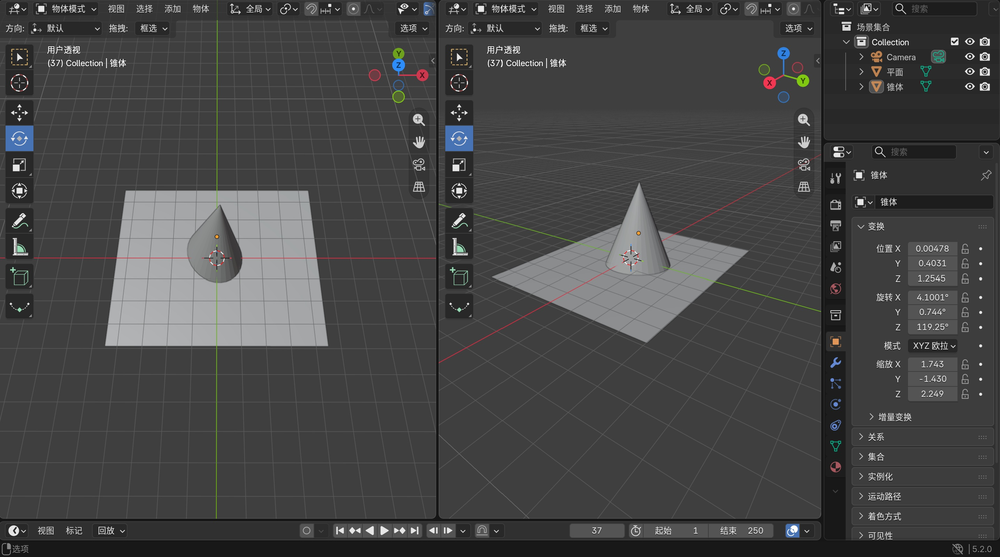
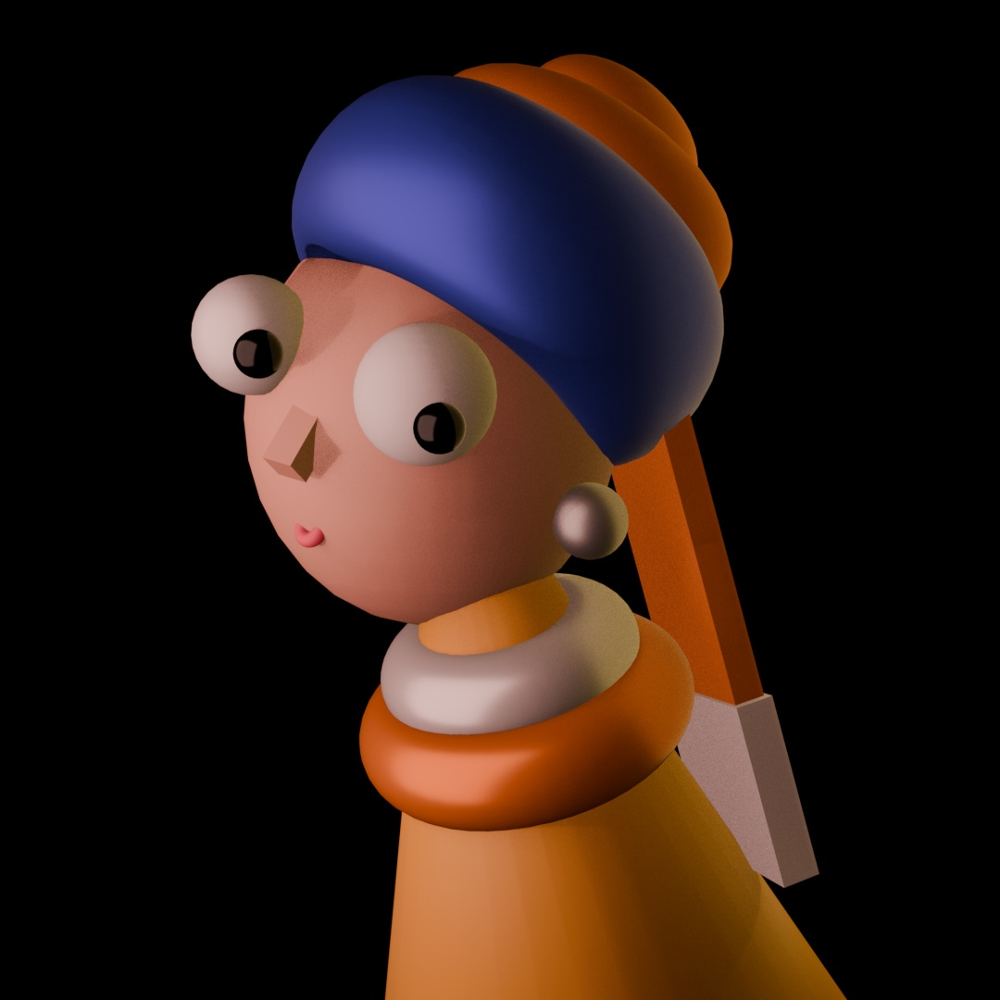
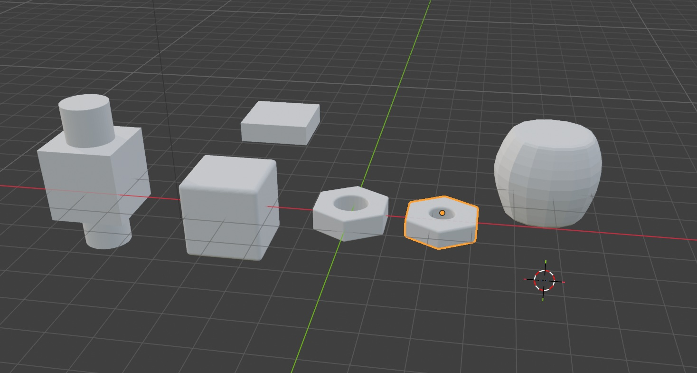
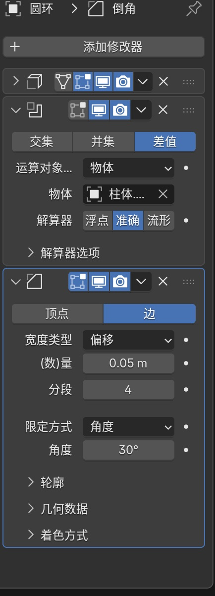
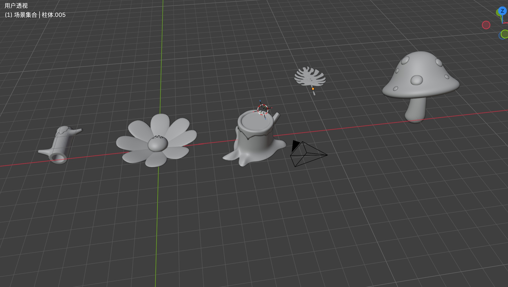
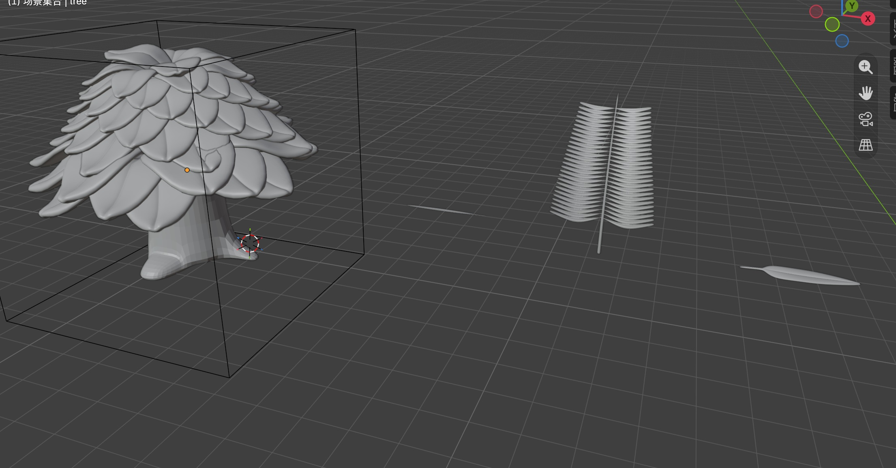

# 视觉小说背景三渲二管线 - 开发日志

## Day 1 - 初识Blender与基础操作 (2026-07-22)

### 今日状态
- **当前进度**：从零起步，首次接触3D建模软件。
- **学习方式**：跟随B站教程，熟悉Blender的基本界面和核心操作。

### 今日目标
- 完成Blender 4.x 版本的安装与环境配置
- 熟悉Blender的四大核心区域（3D视图、大纲视图、属性面板、时间线）
- 掌握基础变换操作：移动 (`G`)、旋转 (`R`)、缩放 (`S`)

### 过程记录

*图1：Blender主界面布局及今日练习的立方体*

### 今日学习心得
- **最大的感受**：3D空间的操作逻辑和2D绘画完全不同，但不需要花时间建立空间感，因为界面很简单易懂。鼠标中键旋转视角的感觉很有趣，感觉像在玩3d游戏。
- **一个小难点**：刚开始容易搞混“物体模式”和“编辑模式”，多切换几次就习惯了。

### 资源
- 跟学视频：[https://www.bilibili.com/video/BV14u41147YH?spm_id_from=333.788.player.switch&vd_source=37cf9b55eeac934a96aa1fb06c88815f&p=3] (1.1-1.3)

## Day 2 - 完成第一个建模练习 (2026-07-23)

### 今日状态
- **当前进度**：完成 Blender 基础操作学习，跟练完成第一个完整建模练习。
- **学习方式**：跟随 KurTips 的《Blender零基础入门教程》，完成 P5 【基础篇】1.4 本章练习[reference:5]。

### 今日目标
- 熟悉 Blender 的建模工具栏与基础操作
- 完成“戴珍珠耳环的少女”模型练习
- 解决材质实时预览问题（需切换到“材质预览”或“渲染模式”）
- 解决多视图合并问题（右键边框 → 合并区域）
- 学会修改渲染背景（世界属性 → 颜色 / 环境纹理 / 透明背景）

### 过程记录

*图1：跟练完成的“珍珠耳环的少女”模型*

### 今日学习心得
**1. 材质实时预览的关键**
调材质时不能实时看到效果，是因为没有切换到正确的视图模式。按 `Z` 键或在视口右上角点击**第三个图标（球体带棋盘格）** 进入“材质预览”模式，材质变化就能实时显示了。如果需要更精确的光影效果，可以切换到**第四个图标（渲染模式）**。

**2. 视图管理小技巧**
不小心拖拽出多个视图时，不用慌张。在两个视图的**边框上右键**，选择 **“合并区域”** ，然后箭头指向想保留的视图即可。Blender 的界面非常灵活，不小心弄乱是每个人的必经之路。

**3. 渲染背景的三种改法**
- **纯色背景**：世界属性 → 表面 → 颜色
- **图片/HDRI背景**：世界属性 → 表面 → 环境纹理 → 打开图片
- **透明背景**（方便后期）：渲染属性 → 胶片 → 勾选“透明”，输出格式选 PNG + RGBA

**4. 第一个模型的感受**
从默认立方体到做出完整的模型，虽然只是跟着教程一步步操作，但第一次感受到“在3D空间里搭建东西”的乐趣。

### 性能数据（基于联想 Yoga 轻薄本测试）
- 软件版本：Blender 4.x (x64)
- 设备型号：联想 Yoga 14 ILL10 (Intel Core Ultra)
- 视图模式：材质预览模式下操作流畅，无卡顿
- 渲染引擎：Eevee（对轻薄本友好）

### 明日计划
- 继续推进教程进度，学习更复杂的建模技巧
- 思考如何将建模技能应用到视觉小说背景场景搭建中

### 今日资源
- 跟学视频：KurTips《Blender零基础入门教程》 BV14u41147YH
- 完成章节：P5 【基础篇】1.4 本章练习

# 视觉小说背景三渲二管线 - 开发日志

## Day 3 - 建模工具进阶 (2026-07-24)

### 今日状态
- **当前进度**：完成 P6-P8（2.1-2.3），掌握Blender常用建模修改器与进阶工具。
- **学习方式**：跟随 KurTips《Blender零基础入门教程》系统学习建模工具链。

### 今日目标
- 掌握 **修改器** 的基本概念与用法（阵列/细分/实体化/倒角）
- 学会使用 **旋转/挤出/缩放** 等工具的进阶技巧
- 完成2.1-2.3章节的随堂练习

### 过程记录

### 今日学习心得

**1. 修改器是建模的“魔法开关”**
今天最大的收获是理解了修改器的逻辑——它不是直接改变模型本身，而是在模型之上叠加一层“效果”。这样做的好处是：
- **不破坏原始几何体**，随时可以调整参数
- **多个修改器可以叠加使用**，产生复杂效果
- **阵列 + 细分 + 实体化** 三个组合，就能做出很多之前觉得复杂的东西

**2. 阵列修改器的实用价值**
对于视觉小说背景来说，阵列简直是神器：
- 一排排的课桌椅 → 阵列搞定
- 书架上的隔层 → 阵列搞定
- 教室窗户的重复结构 → 阵列搞定
**这让“重复劳动”大幅减少，终于能体会到建模为什么比手绘高效了。**

**3. 关于三渲二的思考**
虽然目前还在学基础建模，但脑子里已经在规划最终目标了：
- 学会了**倒角修改器** → 卡出二次元风格需要的硬边/软边
- 学会了**细分修改器** → 让模型表面更光滑，方便后期上卡通材质
- 学会了**阵列修改器** → 批量生成场景元素，大幅提升效率

**4. 从“跟着做”到“自己做”的转变**
今天试着不看教程的下一步，提前自己做完全部过程，虽然中间出现了很多变故，出现了不会细分，记不住快捷键等基础性情况，让我对每个工具的理解加深了，同时也深刻意识到自己的不足之处。

### 性能数据
- 修改器叠加使用时，视口依然流畅（轻薄本无压力）
- 建议：视口显示层级设置为“优化”，避免高细分显示卡顿

### 明日计划
- 继续推进2.4及后续章节
- 开始思考第一个视觉小说背景的场景构图

### 今日资源
- 跟学视频：KurTips《Blender零基础入门教程》BV14u41147YH
- 完成章节：2.1-2.3（修改器基础、阵列、细分、倒角等）

# 视觉小说背景三渲二管线 - 开发日志

## Day 4 - 建模进阶与“踩坑”实录 (2026-07-25)

### 今日状态
- **当前进度**：完成 P9（2.4 章节），在建模练习中密集遇到并解决了多个新手“经典困境”。
- **学习方式**：跟随 KurTips《Blender零基础入门教程》推进，在实战中积累工程经验。

### 今日目标
- 完成 2.4 章节的建模练习
- 掌握 **表面吸附** 功能的完整设置
- 理解 **原点** 与 **几何中心** 的关系，学会修复原点偏离
- 解决“吸附方向反向”问题（目标物体法线方向）
- 掌握 **父子级** 设置（Ctrl+P）
- 学习 **融并边/合并顶点** 操作
- 解决 Shift+A 菜单异常的突发问题

### 过程记录

### 今日踩坑与心得

今天的学习几乎是一场“Blender新手问题大杂烩”，但每解决一个问题，对软件的理解就深一层：

**1. 表面吸附的“正确姿势”**
- **坑**：开了磁铁但死活吸不上，或者吸上去方向是反的。
- **解**：
  - 磁铁要开，**吸附至选“面”**，基准点建议选“中心”或“最近”。
  - 如果方向反了，**检查目标物体的法线方向**（编辑模式下 Alt+N → 重新计算外部）。
  - 关闭 **“对齐旋转到目标”** 可以避免吸附时物体乱转。
  - 最坏的情况下重新建模，如果模型本身反转了那最后吸附的面也是被反转了的面，无法达成想要的效果。

**2. 原点偏离与吸附反向的连锁反应**
- **坑**：在编辑模式下移动整体网格，导致原点留在原地；重置原点后又出现吸附反向。
- **解**：这是“变换数据”与“网格数据”脱节导致的。标准修复流程：
  - 物体模式下按 **Ctrl+A → 全部变换**（烘焙当前变换）
  - 再按 **Ctrl+Shift+Alt+C → 原点→几何中心**
  - 做完这两步，物体就是“干净”的了

**3. 父子级（Parenting）**
- **快捷键**：先选孩子，再选爸爸（最后选中的是父级），按 **Ctrl+P**
- **建议**：选 **“物体（保持变换）”**，子物体不会跳位置
- **用途**：把多个零件组成一个整体，移动父级时子级跟随

**4. 融并边 vs 合并顶点**
- **融并边（Dissolve Edges）**：删掉选中的边，自动合并周围面，不破坏模型
- **合并顶点（Merge Vertices）**：把两个点焊接到一起，按 M 键
- **按距离合并（By Distance）**：一键清理模型中的重叠顶点，非常实用

**5. Shift+A 菜单只剩“网格”怎么办？**
- **原因**：误触了菜单顶部的搜索框，或界面状态被锁定
- **解**：按 Esc 退出，或点击左上角工作区下拉菜单重新选“建模”，或恢复默认界面

### 性能数据
- 今日模型面数增加，但轻薄本仍流畅运行，除了在使用修改器时不小心按错快捷键导致加了上百个细分后电脑崩溃了一次，顺便知道了轻薄本能承载的上限很搞
- 建议：频繁保存（Ctrl+S），养成习惯

### 明日计划
- 继续推进教程后续章节
- 计划将学到的吸附、原点、父子级等技巧应用实际场景搭建中

### 今日资源
- 跟学视频：KurTips《Blender零基础入门教程》BV14u41147YH
- 完成章节：2.4
- 主要练习：建模进阶操作

## Day 5 - 阵列与物体偏移 (2026-07-26)

### 今日状态
- **当前进度**：完成 P10（2.5 章节），掌握利用 **阵列修改器 + 物体偏移** 制作重复元素（如叶片、栏杆）。
- **学习方式**：跟随 KurTips 教程实战，经历“阵列复制乱飞→原点对齐→旋转矫正”的完整调试过程。

### 今日目标
- 掌握阵列修改器 (Array Modifier) 的基础参数
- 理解 **物体偏移 (Object Offset)** 的逻辑：以空物体为基准控制复制品的变换
- 学会将游标与原点对齐（Shift+S 的灵活运用）
- 解决“叶子旋转歪斜”的问题（视角与空间感的训练）

### 过程记录

### 今日踩坑与心得

**1. 阵列偏移的核心逻辑**
- **物体偏移**：指定一个空物体（Empty），阵列出来的每个副本都会继承这个空物体的位移、旋转和缩放增量。
- **应用场景**：非常适合制作视觉小说背景里的重复元素（树叶、路灯、栏杆、砖纹）。只要转动空物体，整排叶子就会跟着弯折，效率极高。

**2. 今天最大的教训：视角！视角！视角！**
- 在透视视图（Perspective）下旋转空物体，由于近大远小的视觉干扰，我觉得自己转正了，但实际歪了几度。
- **正解**：按小键盘 **1（正视图）、3（右视图）、7（顶视图）** 切换到正交视图（Orthographic）进行精确旋转。
- **补刀**：如果笔记本没有小键盘，可以在 `编辑` → `偏好设置` → `输入` 中勾选 **“模拟数字键盘”**，用主键盘区的数字键替代。

**3. 原点与游标的默契配合**
- 想让叶子绕着根部旋转？先把游标放到根部（Shift+右键），再设置原点为3D游标。
- 想让空物体控制叶片不偏移？确保空物体和叶片的原点都在同一个世界坐标点上（Shift+S 联动调整）。

**4. 一个调试小技巧**
- 如果阵列效果乱了，**先关掉修改器的显示（点眼睛图标）**，检查基础模型。基础模型没问题，再开眼睛检查偏移物体。分段排查比瞎调快十倍。

### 明日计划
- 完成 2.6 及后续章节，逐步从“跟练”过渡到“自建场景”。
- 构思我的第一个视觉小说背景草图，准备把学到的阵列、修改器都派上用场。

### 今日资源
- 跟学视频：KurTips《Blender零基础入门教程》 BV14u41147YH
- 完成章节：2.5 - 物体偏移与阵列